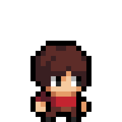
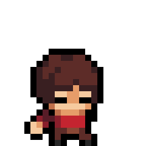
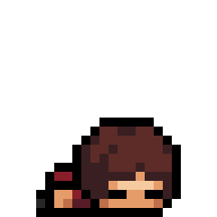
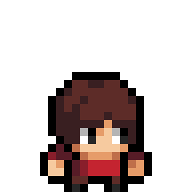
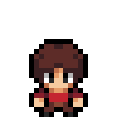
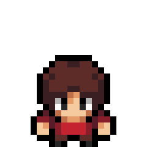

# Sprites

## Table of Contents  
 o [short novice sprites](https://github.com/AaronsLifeGame/platformer/blob/main/artwork/WATCHME.md#short-novice-sprites)  
 o [tall novice sprites](https://github.com/AaronsLifeGame/platformer/blob/main/artwork/WATCHME.md#tall-novice-sprites)   
 o [short archer sprites](https://github.com/AaronsLifeGame/platformer/blob/main/artwork/WATCHME.md#short-archer-sprites)  
 o [tall archer sprites](https://github.com/AaronsLifeGame/platformer/blob/main/artwork/WATCHME.md#tall-archer-sprites)  
 o [short warrior sprites](https://github.com/AaronsLifeGame/platformer/blob/main/artwork/WATCHME.md#short-warrior-sprites)   
 o [tall warrior sprites](https://github.com/AaronsLifeGame/platformer/blob/main/artwork/WATCHME.md#tall-warrior-sprites)  
 o [short mage sprites](https://github.com/AaronsLifeGame/platformer/blob/main/artwork/WATCHME.md#short-mage-sprites)  
 o [tall mage sprites](https://github.com/AaronsLifeGame/platformer/blob/main/artwork/WATCHME.md#tall-mage-sprites)  

## Short novice Sprites

novice Back

novice Down

novice Front

novice Side

novice Up

## tall novice Sprites

novice Back

novice Down

novice Front

novice Side

novice Up

## Short archer Sprites

archer Back

archer Down

archer Front

archer Side

archer Up

## tall archer Sprites

archer Back

archer Down

archer Front

archer Side

archer Up

## Short warrior Sprites

warrior Back

warrior Down

warrior Front

warrior Side

warrior Up

## tall warrior Sprites

warrior Back

warrior Down

warrior Front

warrior Side

warrior Up

## Short mage Sprites

mage Back

mage Down

mage Front

mage Side

mage Up

## tall mage Sprites

mage Back

mage Down

mage Front

mage Side

mage Up

